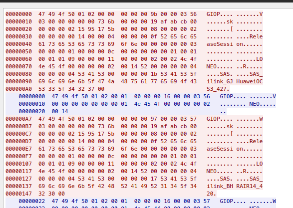

# Log4Shell IIOP Traffic
Log4Shell attack strings which include `iiop://` can result in Internet Interop-Orb-Protocol (IIOP) connection requests.
The signatures detailed below attempt to detection this IIOP traffic. 

A pcap of non-malicious IIOP traffic can be found on [Cloudshark](https://www.cloudshark.org/captures/d706cd5c3906?filter=giop)

Details of the protocol can be found via [Oracle documentation](https://docs.oracle.com/cd/E13211_01/wle/wle42/corba/giop.pdf)

# Example Traffic

# Detection Logic
Network detection for IIOP, which is largely GIOP (General Inter-ORB Protocol) over TCP/IP focuses on alerting of an
Outbound request followed by a valid GIOP message from the server. 

## Outbound Request

| sid     | msg                                  | Notes        | Detection Screenshot          |
|---------|--------------------------------------|--------------|-------------------------------|
| 2034730 | ET POLICY GIOP/IIOP Request Outbound | sets flowbit | [2034730](images/2034730.png) |

## Successful Response
| sid     | msg                                             | Notes                | Detection Screenshot          |
|---------|-------------------------------------------------|----------------------|-------------------------------|
| 2034731 | ET POLICY Successful GIOP/IIOP Request Outbound | depends on `2034730` | [2034731](images/2034731.png) |
