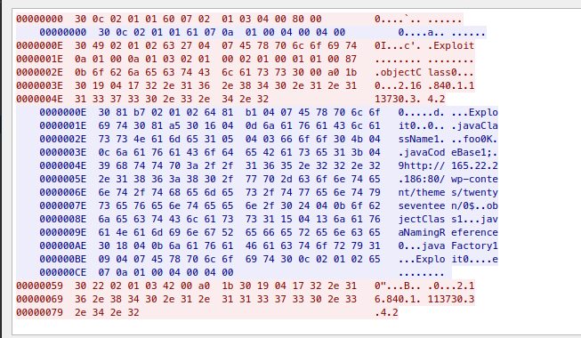

# Log4Shell LDAP Traffic
Log4Shell attack strings which include `ldap://` can result in ldap queries to "malicious ldap" servers for java 
objects.  The signatures detailed below attempt to detect this ldap traffic.  Most often, this is not the actual 
payload, but will result in an actual [Java Class Payload](JavaPayloads.md) betting downloaded from a webserver. 

# Example Traffic
Anonymous LDAPv3 Request with Java Class Response  

# Detection Logic
Multiple signatures have been created in order to detect the different stages of pulling down the java payload via LDAP.

## Outbound Request

| sid     | msg                                                  | Detection Screenshot                               |
|---------|------------------------------------------------------|----------------------------------------------------|
| 2034704 | ET POLICY Anonymous LDAPv3 Bind Request Outbound     | [2034704](LDAP/anon_ldap_with_payload_request.png) |
| 2034812 | ET POLICY Non-Anonymous LDAPv3 Bind Request Outbound | [2034812](LDAP/non-anon_ldap_request.png)          |

## Successful Response

| sid     | msg                                                             | Detection Screenshot                                |
|---------|-----------------------------------------------------------------|-----------------------------------------------------|
| 2034705 | ET POLICY Successful Anonymous LDAPv3 Bind Request Outbound     | [2034705](LDAP/anon_ldap_with_payload_response.png) |
| 2034771 | ET POLICY Successful Non-Anonymous LDAPv3 Bind Request Outbound | [2034771](LDAP/non-anon_ldap_response.png)          |

## Payload Delivery
### Attack Response

These signatures were created based on observed malicious samples. 

| sid     | msg                                                                       | Detection Screenshot                                         |
|---------|---------------------------------------------------------------------------|--------------------------------------------------------------|
| 2034722 | ET ATTACK_RESPONSE Possible CVE-2021-44228 Payload via LDAPv3 Response    | [2034722](LDAP/anon_ldap_with_payload_response_payload.png)  |
| 2034769 | ET ATTACK_RESPONSE Possible CVE-2021-44228 Payload via LDAPv3 Response M2 | [2034769](LDAP/anon_ldap_with_payload_response_payload2.png) |

### Policy
These Signatures are designed to detect broadly Java objects being returned from LDAP and have been created in effort 
to reduce false negatives. 

| sid     | msg                                                                         | Note                 | Detection Screenshot               |
|---------|-----------------------------------------------------------------------------|----------------------|------------------------------------|
| 2034770 | ET POLICY JavaClass Returned Via Anonymous Outbound LDAPv3 Bind Request     | depends on `2034704` | [2034770](LDAP/ldap_javaClass.png) |
| 2034772 | ET POLICY JavaClass Returned Via Non-Anonymous Outbound LDAPv3 Bind Request | depends on `2034812` | [2034772](LDAP/ldap_javaClass.png) |
| 2034818 | ET POLICY Serialized Java Object returned via LDAPv3 Response               |                      | [2034818](LDAP/ldap_javaClass.png) |
