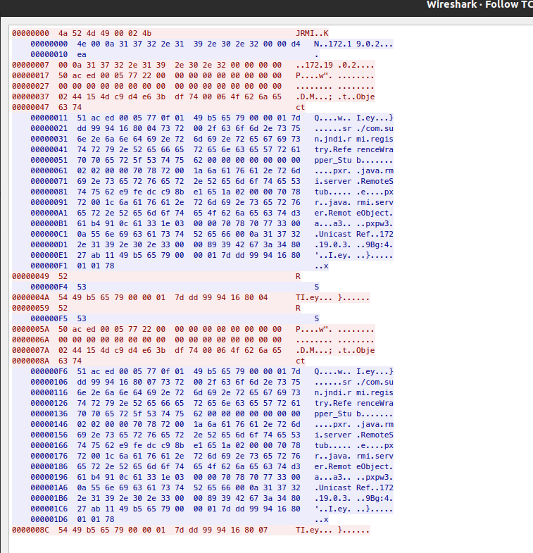

# Log4Shell RMI Traffic
Log4Shell attack strings which include `rmi://` can result in an Remote Method Invocation (RMI) connection to 
"malicious RMI" servers for java objects.  The signatures detailed below attempt to detection this RMI traffic. 

The Wire Protocol for RMI is described within [Oracle Documentation](https://docs.oracle.com/javase/9/docs/specs/rmi/protocol.html)

# Example Traffic

# Detection Logic
Network detection for RMI focuses on alerting of an Outbound request followed by a Java Payload being returned by the 
RMI server. 

## Outbound Request

| sid     | msg                            | Notes        | Detection Screenshot                   |
|---------|--------------------------------|--------------|----------------------------------------|
| 2034718 | ET POLICY RMI Request Outbound | sets flowbit | [2034718](images/outbound_request.png) |

## Successful Response
A successful response is a packet starting with \x4e.  Due to the short and dynamic nature of a server reply, a 
signature was not created for a Successful Response. 

## Payload Delivery
The objective of using RMI is to deliver a Java Payload which will be run by the application.  There are two signatures 
which will alert on Java Payloads returned via an RMI connection.

## Serialized and Unserialized Java Payload

| sid     | msg                                                  | Notes                | Detection Screenshot          |
|---------|------------------------------------------------------|----------------------|-------------------------------|
| 2034748 | ET POLICY Serialized Java Payload via RMI Response   | depends on `2034718` | [2034748](images/2034748.png) |
| 2034749 | ET POLICY Unserialized Java Payload via RMI Response | depends on `2034718` |                               |
